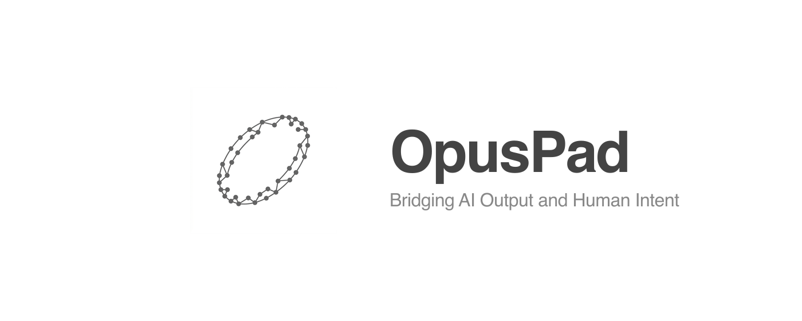

# OpusPad



OpusPad is a Chrome Extension that transforms your browser into a robust local file system editor, bridging the gap between humans and AI agents. It features a dual-editor architecture: a Notion-like WYSIWYG block editor for Markdown files (designed as the perfect medium for human-AI collaboration), and a code editor for plain text and data files. 

## Features

- **Local File System Access:** Mounts a local folder directly in Chrome using the native File System Access API.
- **WYSIWYG Markdown Editor:** Uses BlockNote to provide a Notion-like block editing experience for compatible Markdown files.
- **Code Editor:** Uses CodeMirror for editing plain text, JSON, JS, and incompatible Markdown files with syntax highlighting.
- **Markdown Compatibility Guard:** Ensures no silent data loss occurs during Markdown import/export. Incompatible files (e.g., those containing complex tables or HTML) safely fall back to the source code editor.
- **Auto-save:** Seamless, debounced auto-saving back to the local disk without download prompts.
- **Lazy-loading Sidebar:** Efficiently navigates local directories by only loading nested folders when expanded.
- **Binary File Rejection:** Safely prevents opening and editing of unsupported binary files.

## Installation

To install the extension locally for development or personal use:

1. **Clone the repository:**
   ```bash
   git clone https://github.com/luanjunyi/md-editor-in-chrome.git
   cd md-editor-chrome
   ```

2. **Install dependencies:**
   ```bash
   npm install
   ```

3. **Build the extension:**
   ```bash
   npm run build
   ```
   *This will generate a `dist/` directory containing the compiled Chrome Extension.*

4. **Load into Chrome:**
   - Open Google Chrome and navigate to `chrome://extensions/`.
   - Enable **Developer mode** using the toggle switch in the top right corner.
   - Click the **Load unpacked** button.
   - Select the `dist` directory generated in the previous step.

## Usage & Permissions

1. **Open the Editor:** Pin the extension to your Chrome toolbar and click the icon. The editor will open in a new full-screen tab.
2. **Mount a Workspace:** Click the **Open Folder** button in the center of the screen.
3. **Grant Permissions:** 
   - A native browser directory picker will appear. Select a local folder you want to edit.
   - Chrome will prompt you for permissions (e.g., "Let site view files?" and "Let site save changes?"). You must grant **read/write** permissions for the extension to save files automatically.
4. **Edit:** 
   - Navigate your files using the left sidebar. 
   - Click a `.md` file to open it in the WYSIWYG editor. 
   - Click a `.txt` or `.json` file to open it in the code editor. 
   - Changes are auto-saved to your local disk after half a second of inactivity.

## Tech Stack

- **Framework:** React 18, TypeScript, Vite
- **Extension Build:** `@crxjs/vite-plugin` (Manifest V3)
- **Markdown Editor:** [BlockNote](https://www.blocknotejs.org/) (built on ProceMirror/Tiptap)
- **Text/Code Editor:** [CodeMirror 6](https://codemirror.net/) (`@uiw/react-codemirror`)
- **Testing:** Vitest (Unit) and Playwright (E2E)
- **Icons:** Lucide React
